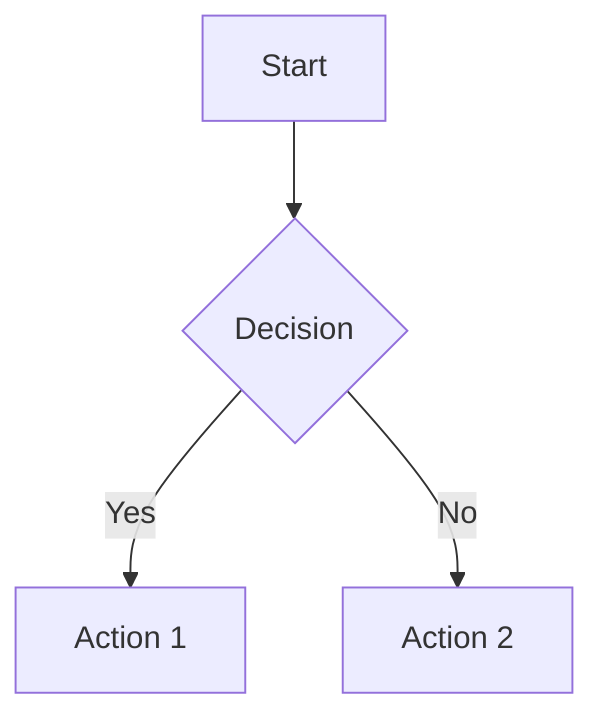

# Fumadocs: Comprehensive Documentation Framework Guide

## Table of Contents

1. [What is Fumadocs](#what-is-fumadocs)
2. [Core Architecture](#core-architecture)
3. [Installation & Setup](#installation--setup)
4. [Layout System](#layout-system)
5. [Component System](#component-system)
6. [Navigation & Search](#navigation--search)
7. [Content Creation](#content-creation)
8. [Advanced Features](#advanced-features)
9. [Integrations](#integrations)
10. [Production Deployment](#production-deployment)
11. [Best Practices](#best-practices)

## What is Fumadocs

Fumadocs is a modern **documentation framework** built on Next.js App Router that prioritizes flexibility, customization, and developer control over configuration-driven approaches. It follows a "less abstraction" philosophy, allowing developers to break and modify the framework as needed.

### Key Principles
- **Framework you can break** - Maximum customization over rigid configuration
- **Next.js native** - Deep integration with Next.js App Router
- **TypeScript-first** - Built with TypeScript for better developer experience
- **Performance-focused** - Static generation with dynamic capabilities
- **Component-driven** - React components for everything

### Problems It Solves
- Seamless integration with existing Next.js applications
- Flexible content sources (MDX, CMS, APIs)
- Modern search with multiple engine options
- Advanced theming and customization
- Production-ready performance and scalability

## Core Architecture

Fumadocs consists of **four main components**:

### 1. Fumadocs Core (`fumadocs-core`)
**Purpose**: Headless functionality and logic
- Document search algorithms
- Content source adapters
- Markdown processing and extensions
- Routing and navigation logic

### 2. Fumadocs UI (`fumadocs-ui`)
**Purpose**: Default theme and UI components
- Responsive layouts (Docs, Home, Notebook)
- Interactive components (Tabs, Accordion, etc.)
- Built with Tailwind CSS
- Mobile-first responsive design
- Light/dark mode support

### 3. Content Source
**Purpose**: Content management and processing
- **Fumadocs MDX** - Official MDX content source
- File-based routing with `meta.json`
- Support for external CMS integration
- TypeScript integration for API docs

### 4. Fumadocs CLI
**Purpose**: Development and setup automation
- Component installation (like Shadcn UI)
- Layout customization
- Project scaffolding

## Installation & Setup

### Quick Start
```bash
# Automatic setup (recommended)
npm create fumadocs-app

# Manual installation
npm install fumadocs-ui fumadocs-core fumadocs-mdx
```

### Project Structure
```
├── app/
│   ├── docs/
│   │   ├── [[...slug]]/
│   │   │   └── page.tsx      # Catch-all route
│   │   └── layout.tsx        # Docs layout
│   ├── layout.tsx            # Root layout
│   └── layout.config.tsx     # Shared config
├── content/
│   └── docs/                 # MDX content
├── mdx-components.tsx        # MDX components
├── source.config.ts          # Content source config
└── next.config.js
```

### Basic Configuration

#### Root Layout (`app/layout.tsx`)
```tsx
import { RootProvider } from 'fumadocs-ui/provider';

export default function Layout({ children }) {
  return (
    <html lang="en">
      <body>
        <RootProvider>{children}</RootProvider>
      </body>
    </html>
  );
}
```

#### Docs Layout (`app/docs/layout.tsx`)
```tsx
import { DocsLayout } from 'fumadocs-ui/layouts/docs';
import { source } from '@/lib/source';
import { baseOptions } from '@/app/layout.config';

export default function Layout({ children }: { children: ReactNode }) {
  return (
    <DocsLayout {...baseOptions} tree={source.pageTree}>
      {children}
    </DocsLayout>
  );
}
```

## Layout System

### Layout Hierarchy
```
RootProvider (Required at root)
├── HomeLayout (Marketing pages)
├── DocsLayout (Documentation with sidebar)
├── NotebookLayout (Compact docs)
└── DocsPage (Individual page wrapper)
```

### Layout Types

#### 1. Root Provider
**Required at application root**
```tsx
<RootProvider
  search={{ enabled: true }}
  theme={{ enabled: true }}
>
  {children}
</RootProvider>
```

#### 2. Home Layout
**For marketing/landing pages**
```tsx
<HomeLayout {...baseOptions}>
  {children}
</HomeLayout>
```
- Navbar with search
- Designed for non-documentation pages
- Works with Route Groups

#### 3. Docs Layout
**Full documentation layout**
```tsx
<DocsLayout 
  {...baseOptions} 
  tree={pageTree}
  sidebar={{ prefetch: false }}
  nav={{ transparentMode: 'top' }}
>
  {children}
</DocsLayout>
```

**Features**:
- Full sidebar navigation
- Mobile responsive navbar
- Table of contents
- Advanced prefetching controls

#### 4. Notebook Layout
**Compact documentation**
```tsx
<DocsLayout {...baseOptions} tree={pageTree}>
  {children}
</DocsLayout>
```
- More compact than Docs Layout
- Opinionated styling
- Additional configuration options

#### 5. Docs Page
**Individual page wrapper**
```tsx
<DocsPage>
  <DocsTitle>Page Title</DocsTitle>
  <DocsDescription>Description</DocsDescription>
  <DocsBody>
    Content goes here
  </DocsBody>
</DocsPage>
```

### Shared Configuration
```tsx
// app/layout.config.tsx
import type { BaseLayoutProps } from 'fumadocs-ui/layouts/shared';

export const baseOptions: BaseLayoutProps = {
  nav: {
    title: 'My Documentation',
    transparentMode: 'top',
  },
  links: [
    {
      text: 'Documentation',
      url: '/docs',
      active: 'nested-url',
    },
    {
      type: 'icon',
      icon: <GithubIcon />,
      url: 'https://github.com/username/repo',
    },
  ],
  githubUrl: 'https://github.com/username/repo',
};
```

## Component System

### Built-in Components

#### Accordion
```mdx
import { Accordion, Accordions } from 'fumadocs-ui/components/accordion';

<Accordions type="single">
  <Accordion title="FAQ Item" id="faq-1">
    Answer content
  </Accordion>
</Accordions>
```

#### Banner
```tsx
import { Banner } from 'fumadocs-ui/components/banner';

<Banner variant="rainbow" id="announcement">
  Important announcement!
</Banner>
```

#### Tabs
```mdx
<Tabs items={['JavaScript', 'Python']} groupId="language" persist>
  <Tab value="JavaScript">
    ```js
    console.log('Hello World');
    ```
  </Tab>
  <Tab value="Python">
    ```python
    print("Hello World")
    ```
  </Tab>
</Tabs>
```

**Advanced Features**:
- `groupId`: Sync tabs across page
- `persist`: Save selection in localStorage
- `updateAnchor`: URL hash integration

#### Steps
```mdx
<Steps>
  <Step>
    ### Step 1: Setup
    Initial configuration
  </Step>
  <Step>
    ### Step 2: Implementation
    Write the code
  </Step>
</Steps>
```

#### Files
```mdx
<Files>
  <Folder name="src" defaultOpen>
    <File name="index.ts" />
    <File name="utils.ts" />
  </Folder>
  <File name="package.json" />
</Files>
```

#### Type Tables
```mdx
<!-- Manual type table -->
<TypeTable
  type={{
    name: {
      description: 'Component name',
      type: 'string',
      required: true,
    },
  }}
/>

<!-- Auto-generated from TypeScript -->
<AutoTypeTable path="./types.ts" name="MyInterface" />
```

### MDX Components

#### Callouts
```mdx
<Callout type="info" title="Information">
  This is an informational callout
</Callout>

<Callout type="warn" title="Warning">
  This is a warning callout
</Callout>
```

#### Cards
```mdx
<Cards>
  <Card href="/getting-started" title="Getting Started" icon={<StartIcon />}>
    Learn the basics of our platform
  </Card>
</Cards>
```

### Component Integration
```tsx
// mdx-components.tsx
import defaultMdxComponents from 'fumadocs-ui/mdx';
import * as TabsComponents from 'fumadocs-ui/components/tabs';
import type { MDXComponents } from 'mdx/types';

export function getMDXComponents(components?: MDXComponents): MDXComponents {
  return {
    ...defaultMdxComponents,
    ...TabsComponents,
    ...components,
  };
}
```

## Navigation & Search

### Navigation System

#### Automatic Navigation
```tsx
// Uses file structure for navigation
<DocsLayout tree={source.pageTree} />
```

#### Manual Navigation
```tsx
const tree = {
  name: 'Documentation',
  children: [
    {
      type: 'page',
      name: 'Introduction',
      url: '/docs',
    },
    {
      type: 'folder',
      name: 'Guides',
      children: [
        {
          type: 'page',
          name: 'Getting Started',
          url: '/docs/getting-started',
        },
      ],
    },
  ],
};
```

#### Sidebar Tabs
```tsx
<DocsLayout
  sidebar={{
    tabs: [
      {
        title: 'User Guide',
        url: '/docs/guide',
      },
      {
        title: 'API Reference',
        url: '/docs/api',
      },
    ],
  }}
/>
```

### Search System

#### Default Setup (Orama)
```tsx
const { search, setSearch, query } = useDocsSearch({
  type: 'fetch',
  locale: 'en',
});
```

#### Algolia Integration
```tsx
import { liteClient as algoliasearch } from 'algoliasearch/lite';

const client = algoliasearch(appId, apiKey);

const { search, setSearch, query } = useDocsSearch({
  type: 'algolia',
  client,
  indexName: 'documents',
});
```

#### Custom Search UI
```tsx
<SearchDialog>
  <SearchDialogInput placeholder="Search documentation..." />
  <SearchDialogContent>
    <SearchDialogList
      items={query.data}
      Item={(props) => (
        <SearchDialogListItem
          {...props}
          renderHighlights={(highlights) => (
            <CustomHighlight highlights={highlights} />
          )}
        />
      )}
    />
  </SearchDialogContent>
</SearchDialog>
```

## Content Creation

### Markdown Extensions

#### Enhanced Headings
```md
# Heading with Custom ID [#custom-id]
## Hidden from TOC [!toc]
### TOC Only [toc]
```

#### Code Blocks with Features
````md
```typescript title="example.ts" {1,3-5} showLineNumbers
function hello() {
  // [!code highlight]
  console.log('Hello World');
  // [!code ++]
  return 'success';
  // [!code --]
  return 'old implementation';
}
```
````

#### NPM Commands
````md
```bash npm2yarn
npm install fumadocs-ui
```
````

#### Tab Groups
````md
```js tab="JavaScript"
console.log('Hello');
```

```py tab="Python" 
print('Hello')
```
````

### Mathematical Expressions
```md
Inline math: $$E = mc^2$$

Block math:
```math
\int_{-\infty}^{\infty} e^{-x^2} dx = \sqrt{\pi}
```
```

### Mermaid Diagrams
```md

```

### TypeScript Integration
```mdx
<AutoTypeTable path="./api.ts" name="APIResponse" />
```

## Advanced Features

### Internationalization

#### Setup
```tsx
// middleware.ts
import { createI18nMiddleware } from 'fumadocs-core/middleware';

export default createI18nMiddleware({
  languages: ['en', 'es', 'fr'],
  defaultLanguage: 'en',
});
```

#### Content Structure
```
content/
├── docs/
│   ├── en/
│   │   └── index.mdx
│   ├── es/
│   │   └── index.mdx
│   └── fr/
│       └── index.mdx
```

#### Localized Navigation
```tsx
<DocsLayout
  tree={source.pageTree[params.lang]}
  {...baseOptions}
/>
```

### Versioning

#### Folder-based Versioning
```
content/
├── docs/
│   ├── v1/
│   └── v2/
```

```tsx
<DocsLayout
  sidebar={{
    tabs: [
      { title: 'v2.0', url: '/docs/v2' },
      { title: 'v1.0', url: '/docs/v1' },
    ],
  }}
/>
```

#### Git Branch Versioning
- Separate deployments per version
- Isolated environments
- Better for major version differences

### Theme System

#### Built-in Themes
```tsx
// tailwind.config.js
import { createPreset } from 'fumadocs-ui/tailwind-plugin';

export default {
  presets: [
    createPreset({
      preset: 'ocean', // neutral, black, vitepress, dusk, catppuccin, ocean, purple
    }),
  ],
};
```

#### Custom Theming
```css
:root {
  --background: 0 0% 100%;
  --foreground: 222.2 84% 4.9%;
  --primary: 221.2 83.2% 53.3%;
  --primary-foreground: 210 40% 98%;
}
```

### Static Export
```js
// next.config.js
const config = {
  output: 'export',
  trailingSlash: true,
};
```

## Integrations

### OpenAPI Documentation

#### Setup
```tsx
import { attachments, generateFiles } from 'fumadocs-openapi';

generateFiles({
  input: './openapi.json',
  output: './content/docs/api',
  groupBy: 'tag',
});
```

#### Features
- Interactive API playground
- Multi-language code examples
- Request/response schemas
- Authentication documentation

### TypeScript Documentation
```tsx
import { createGenerator } from 'fumadocs-typescript';

const generator = createGenerator({
  include: ['./src/**/*.ts'],
});
```

### AI Integration
```tsx
// Enable AI-friendly exports
export default createMDXSource(files, {
  // Generates llms-full.txt for AI training
  experimental: {
    generateLLMText: true,
  },
});
```

### Feedback System
```tsx
<RateCard
  onSubmit={async (feedback) => {
    'use server';
    // Handle feedback
    await saveFeedback(feedback);
  }}
/>
```

### RSS Feeds
```tsx
// app/rss.xml/route.ts
import RSS from 'rss';

export function GET() {
  const feed = new RSS({
    title: 'Documentation Updates',
    description: 'Latest changes',
  });
  
  // Add items to feed
  return new Response(feed.xml());
}
```

## Production Deployment

### Performance Optimization
- **Static Generation**: Full Next.js static export support
- **Code Splitting**: Automatic with Next.js
- **Search Indexes**: Pre-built for offline search
- **Image Optimization**: Next.js Image component

### Deployment Options

#### Vercel (Recommended)
```bash
npm run build
# Automatic deployment with Git integration
```

#### Static Hosting
```bash
npm run build
npm run export
# Deploy dist/ folder to any static host
```

#### Docker Deployment
```dockerfile
FROM node:18-alpine
WORKDIR /app
COPY . .
RUN npm ci && npm run build
EXPOSE 3000
CMD ["npm", "start"]
```

### Security Considerations
- **CORS Handling**: Built-in proxy for API docs
- **Content Security**: Sanitized markdown rendering
- **Authentication**: GitHub App integration for feedback
- **Environment Variables**: Secure configuration management

## Best Practices

### Content Organization
1. **Use semantic file structure** for automatic navigation
2. **Implement meta.json** for custom ordering and metadata
3. **Create logical groupings** with folders and tabs
4. **Use descriptive filenames** that match URL structure

### Component Usage
1. **Prefer built-in components** for consistency
2. **Use AutoTypeTable** for TypeScript projects
3. **Implement persistent tabs** for better UX
4. **Add proper anchors** for deep linking

### Performance
1. **Enable static export** when possible
2. **Optimize images** with Next.js Image component
3. **Use proper caching** for search indexes
4. **Implement lazy loading** for heavy components

### SEO & Accessibility
1. **Add proper meta tags** in frontmatter
2. **Use semantic HTML** in custom components
3. **Implement proper heading hierarchy**
4. **Test keyboard navigation**

### Development Workflow
1. **Use TypeScript** for better developer experience
2. **Implement proper linting** with ESLint configuration
3. **Set up automated testing** for custom components
4. **Use Git hooks** for content validation

### Maintenance
1. **Regular updates** of Fumadocs dependencies
2. **Monitor search performance** and optimize indexes
3. **Track user feedback** and iterate on content
4. **Backup content** with proper version control

## Conclusion

Fumadocs provides a comprehensive, flexible documentation framework that scales from simple documentation sites to complex, multi-lingual, API-integrated platforms. Its Next.js-native approach makes it ideal for teams already using React and Next.js, while its extensive customization options ensure it can adapt to any design system or content structure.

The framework excels at:
- **Developer Experience**: TypeScript-first, excellent tooling
- **Flexibility**: Maximum customization over configuration
- **Performance**: Static generation with dynamic capabilities  
- **Modern Features**: AI integration, advanced search, responsive design
- **Production Ready**: Comprehensive deployment and scaling options

Whether building simple documentation or complex developer portals, Fumadocs provides the foundation and flexibility needed for modern documentation experiences.